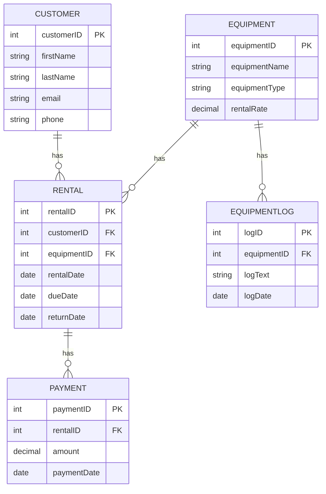

# Rental Database Project
  Hey there, fellow coders! 👋   
  
  Welcome to my latest adventure in the tech world! 
  This project is a unique blend of skills and passions, 
  combining my journey through the **Code Girls First SQL Database** course 
  with the backend mastery gained through a **Santander Group scholarship in Java Backend by Dio**.

  I've taken the database I created for a film equipment rental service 
  and am supercharging it with a Java Spring Boot API, using Gradle as my trusty build tool. 
  And guess what? Then I'm taking my baby to the cloud with Railway!

# API URL
  Visit to check my progress!  
  https://rental-app.up.railway.app/swagger-ui/index.html#

  **Next updates**: Payment & Rentals business logic. 

  Please, feel free to test and send me any comments or suggestions!  
  
# UML class diagram

